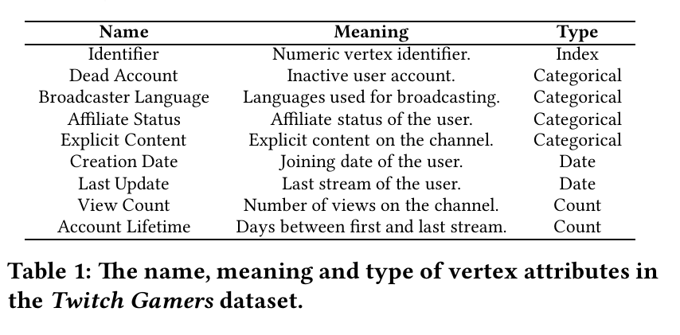

## ToC

- [SNAP Source](https://snap.stanford.edu/data/twitch_gamers.html)
- [Github](https://github.com/benedekrozemberczki/datasets)
- [Paper](https://arxiv.org/abs/2101.03091)

## Vertex Attributes

These are the attributes provided per Vertex

## Possible Applications

- Categorical attributes such as **DeadAccount**, **AffiliateStatus**, and **Explicit Content** can be used as targets for <u>**binary classification**</u>
- **Broadcaster Language** can be used for multi-class node classification with more than 20 categories.
- **View Count** and **Account Lifetime** can serve as target for **count data regression problems** at the node level.
- **Other possiblities:**
  - link prediction
  - community dectection with ground truth labels
  - 

